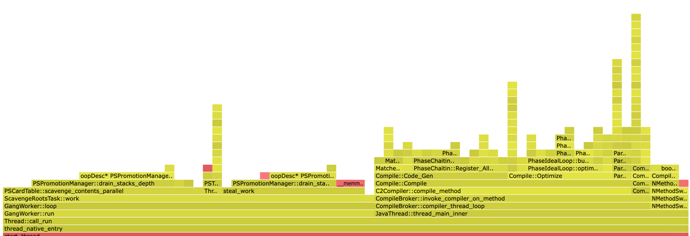

# async

This project provides an embedded solution for Async Profiler https://github.com/async-profiler/async-profiler within a Java application, with modules for core functionality, Spring integration, and annotations. It enables you to capture profiling data at regular intervals and automatically generate HTML reports that can be viewed in a browser.

## Features

1. Embedded Async Profiler for Java applications.
2. Captures profiling data at scheduled intervals.
3. Generates easy-to-read HTML reports.
4. Supports multiple profiling events like CPU, ALLOC, and WALL.
5. Can profile main method within async-annotation.

## Artifacts
1. `async-core`: Core profiling functionalities.
2. `async-spring`: Profiling integration with Spring applications.
3. `async-annotation`: Annotations for easy profiling in main methods.


# pre-requisite

`Java 17+`


## Supported Machines


| CPU Arch | Linux | MacOS | Windows |
|----------|-------|-------|---------|
| x86_64   | ✔️     | ✔️     | ❌       |
| arm      | ✔️     | ✔️     | ❌       |
| arm64    | ✔️     | ✔️     | ❌       |


# Module Details

## async-core

The core module of the project, responsible for managing the actual profiling tasks.


### Dependency


	<dependency>
		<groupId>io.github.omarmahamid</groupId>
		<artifactId>async-core</artifactId>
		<version>${LATEST_VERSION}</version>
  	</dependency>

## async-spring

Provides seamless integration with Spring, allowing you to enable async profiling in your Spring services. Profiling reports are generated automatically at scheduled intervals.


### Dependency


	<dependency>
		<groupId>io.github.omarmahamid</groupId>
		<artifactId>async-spring</artifactId>
		<version>${LATEST_VERSION}</version>
  	</dependency>


### Configuration

`async-profiler-enabled` - Enable profiler to work.

`async-profiler-event` - Event of async profiler (CPU, ALLOC, WALL). (Default is CPU)

`async-profiler-duration` - Duration of interval profiling in seconds. (Default is 1000)

`async-profiler-basedir` - The based directory to dump the html files in. (Default is base application dir)

### Generated File

async will generate a html file that can be shown in the browser.




## async-annotation

Allows you to use custom annotations to specify which parts of your code should be profiled. This makes it easy to apply profiling to specific methods or classes.


### Dependency


	<dependency>
		<groupId>io.github.omarmahamid</groupId>
		<artifactId>async-annotation</artifactId>
		<version>${LATEST_VERSION}</version>
  	</dependency>


## Usage

adding @Profiling annotation on main method

```java
package io.github.omarmahamid.annotation;

import io.github.omarmahamid.async.ModeAsyncProfiler;

import java.lang.annotation.ElementType;
import java.lang.annotation.Retention;
import java.lang.annotation.RetentionPolicy;
import java.lang.annotation.Target;


@Retention(RetentionPolicy.RUNTIME)
@Target(ElementType.METHOD)
public @interface Profiling {

    ModeAsyncProfiler mode() default ModeAsyncProfiler.CPU;

    long duration() default 30; // in millisecond

    String fileDump();
}
```


## Example

```java
package io.github.omarmahamid.annotation;


import java.math.BigDecimal;


public class Main {


    @Profiling(fileDump = "/Users/omarmahamid/Documents/GitHub/async/async-annotation/profiling.html")
    public static void main(String[] args) {

        ProfilingProcessor.startProcess(Main.class);
        
        // Custom logic code
    }
}
```

stopProcess is not necessary since there is a shutdown hook that will stop the profiler

## Result

just open the path:

/Users/omarmahamid/Documents/GitHub/async/async-annotation/profiling.html


# Contributions
Contributions are welcome! Feel free to submit issues or pull requests to help improve this project.


